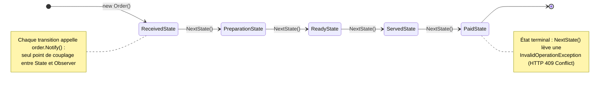

# Diagramme UML RestaurantApi

## 1. Diagramme de classes complet

Chaque classe porte son **rôle GoF en annotation** (`«ConcreteCreator»`, `«Context»`, …) et chaque
pattern est regroupé dans un **cadre nommé**.

```mermaid
classDiagram
    direction TR

    %% ================================================================
    %% PATTERN 1 : FACTORY METHOD
    %% ================================================================
    namespace Pattern_Factory_Method {
        class IDish {
            <<interface / Product>>
            +string Name
            +double Price
            +TimeSpan PreparationTime
            +DishCategory Category
            +string Description
        }
        class Starter {
            <<ConcreteProduct>>
            +Guid Id
        }
        class MainCourse {
            <<ConcreteProduct>>
            +Guid Id
        }
        class Dessert {
            <<ConcreteProduct>>
            +Guid Id
        }
        class Beverage {
            <<ConcreteProduct>>
            +Guid Id
            +bool IsAlcoholic
        }
        class DishFactory {
            <<abstract / Creator>>
            #TimeSpan DefaultPreparationTime*
            +CreateDish(CreateDishRequest) IDish*
            #ResolvePreparationTime(CreateDishRequest) TimeSpan
        }
        class StarterFactory {
            <<ConcreteCreator>>
            #TimeSpan DefaultPreparationTime
            +CreateDish(CreateDishRequest) IDish
        }
        class MainCourseFactory {
            <<ConcreteCreator>>
            #TimeSpan DefaultPreparationTime
            +CreateDish(CreateDishRequest) IDish
        }
        class DessertFactory {
            <<ConcreteCreator>>
            #TimeSpan DefaultPreparationTime
            +CreateDish(CreateDishRequest) IDish
        }
        class BeverageFactory {
            <<ConcreteCreator>>
            #TimeSpan DefaultPreparationTime
            +CreateDish(CreateDishRequest) IDish
        }
        class DishFactoryProvider {
            <<Registre de fabriques>>
            -Dictionary factories
            +GetFactory(DishCategory) DishFactory
        }
    }

    %% ================================================================
    %% PATTERN 2 : STRATEGY
    %% ================================================================
    namespace Pattern_Strategy {
        class IPriceOrder {
            <<interface / Strategy>>
            +CalculatePrice(Order) double
            +GetDescription() string
        }
        class StandardStrategy {
            <<ConcreteStrategy>>
            +CalculatePrice(Order) double
            +GetDescription() string
        }
        class HappyHourStrategy {
            <<ConcreteStrategy>>
            +CalculatePrice(Order) double
            +GetDescription() string
        }
        class GroupStrategy {
            <<ConcreteStrategy>>
            +CalculatePrice(Order) double
            +GetDescription() string
        }
        class MenuStrategy {
            <<ConcreteStrategy>>
            -double MenuPrice
            +CalculatePrice(Order) double
            +GetDescription() string
            -TryExtractMenu(List) bool$
            -PickBest(List, DishCategory) IDish$
        }
        class PriceCalculator {
            <<Context>>
            -Dictionary strategies
            +GetStrategy(PricingPolicy) IPriceOrder
            +CalculatePrice(Order) double
            +GetDescription(Order) string
        }
    }

    %% ================================================================
    %% PATTERN 3 : STATE
    %% ================================================================
    namespace Pattern_State {
        class OrderState {
            <<abstract / State>>
            #Order order
            #BuildNextState() OrderState*
            +NextState() void
            +GetStateName() string
        }
        class ReceivedState {
            <<ConcreteState>>
            #BuildNextState() OrderState
        }
        class PreparationState {
            <<ConcreteState>>
            #BuildNextState() OrderState
        }
        class ReadyState {
            <<ConcreteState>>
            #BuildNextState() OrderState
        }
        class ServedState {
            <<ConcreteState>>
            #BuildNextState() OrderState
        }
        class PaidState {
            <<ConcreteState terminal>>
            #BuildNextState() OrderState
        }
    }

    %% ================================================================
    %% PATTERN 4 : OBSERVER
    %% ================================================================
    namespace Pattern_Observer {
        class INotificationSubject {
            <<interface / Subject>>
            +Subscribe(INotificationObserver) void
            +Unsubscribe(INotificationObserver) void
            +Notify(Order) void
        }
        class INotificationObserver {
            <<interface / Observer>>
            +Update(Order) void
            +GetObserverName() string
        }
        class KitchenService {
            <<ConcreteObserver>>
            +Update(Order) void
            +GetObserverName() string
        }
        class DiningService {
            <<ConcreteObserver>>
            +Update(Order) void
            +GetObserverName() string
        }
        class BillingService {
            <<ConcreteObserver>>
            +Update(Order) void
            +GetObserverName() string
        }
    }

    %% ================================================================
    %% PATTERN 5 : SINGLETON
    %% ================================================================
    namespace Pattern_Singleton {
        class RestaurantConfiguration {
            <<sealed / Singleton>>
            -Lazy instance$
            +RestaurantConfiguration Instance$
            +string RestaurantName
            +string Currency
            +int TableCount
            +double ServiceChargeRate
            +IReadOnlyList Menu
            +IReadOnlyList OpeningHours
            -RestaurantConfiguration()
            -BuildMenu() List$
        }
    }

    %% ================================================================
    %% MODELE METIER
    %% ================================================================
    namespace Modele_metier {
        class Order {
            <<Context State / ConcreteSubject Observer>>
            -List observers
            +string Id
            +int TableNumber
            +List Items
            +double TotalPrice
            +OrderState Status
            +DateTime CreatedAt
            +PricingPolicy Policy
            +AddItem(IDish) void
            +Subscribe(INotificationObserver) void
            +Unsubscribe(INotificationObserver) void
            +UnsubscribeByName(string) bool
            +GetObserverNames() IEnumerable
            +Notify(Order) void
        }
        class OpeningHours {
            <<record>>
            +DayOfWeek Day
            +TimeOnly Opening
            +TimeOnly Closing
            +bool IsClosed
        }
        class OrderRepository {
            <<Repository in-memory>>
            -Dictionary _orders
            +Add(Order) void
            +GetById(string) Order
            +GetAll() List
        }
    }

    %% ================================================================
    %% DTO ET ENUMERATIONS
    %% ================================================================
    namespace Contrats_DTO_et_Enums {
        class CreateDishRequest {
            <<record / DTO>>
            +string Name
            +double Price
            +DishCategory Category
            +int PreparationTimeMinutes
            +bool IsAlcoholic
        }
        class CreateOrderRequest {
            <<record / DTO>>
            +int TableNumber
            +List Items
            +PricingPolicy Policy
        }
        class DishResponse {
            <<record / DTO>>
            +From(IDish) DishResponse$
        }
        class OrderResponse {
            <<record / DTO>>
            +From(Order, string) OrderResponse$
        }
        class DishCategory {
            <<enumeration>>
            Starter
            MainCourse
            Dessert
            Beverage
        }
        class PricingPolicy {
            <<enumeration>>
            Standard
            HappyHour
            Group
            Menu
        }
    }

    %% ---------------- Factory Method ----------------
    IDish <|.. Starter
    IDish <|.. MainCourse
    IDish <|.. Dessert
    IDish <|.. Beverage
    DishFactory <|-- StarterFactory
    DishFactory <|-- MainCourseFactory
    DishFactory <|-- DessertFactory
    DishFactory <|-- BeverageFactory
    DishFactory ..> IDish : crée
    StarterFactory ..> Starter : crée
    MainCourseFactory ..> MainCourse : crée
    DessertFactory ..> Dessert : crée
    BeverageFactory ..> Beverage : crée
    DishFactoryProvider "1" *-- "4" DishFactory : registre par catégorie
    DishFactory ..> CreateDishRequest : paramètre
    IDish --> DishCategory : Category

    %% ---------------- Strategy ----------------
    IPriceOrder <|.. StandardStrategy
    IPriceOrder <|.. HappyHourStrategy
    IPriceOrder <|.. GroupStrategy
    IPriceOrder <|.. MenuStrategy
    PriceCalculator "1" *-- "4" IPriceOrder : registre par politique
    IPriceOrder ..> Order : lit Items
    Order --> PricingPolicy : Policy

    %% ---------------- State ----------------
    OrderState <|-- ReceivedState
    OrderState <|-- PreparationState
    OrderState <|-- ReadyState
    OrderState <|-- ServedState
    OrderState <|-- PaidState
    Order "1" *-- "1" OrderState : Status
    OrderState --> "1" Order : contexte

    %% ---------------- Observer ----------------
    INotificationSubject <|.. Order
    INotificationObserver <|.. KitchenService
    INotificationObserver <|.. DiningService
    INotificationObserver <|.. BillingService
    Order "1" o-- "0..*" INotificationObserver : observers
    INotificationObserver ..> Order : Update(order)

    %% ---------------- Singleton ----------------
    RestaurantConfiguration "1" *-- "8" IDish : Menu
    RestaurantConfiguration "1" *-- "7" OpeningHours
    RestaurantConfiguration ..> DishFactoryProvider : construit le menu

    %% ---------------- Modele et DTO ----------------
    Order "1" *-- "1..*" IDish : Items
    OrderRepository "1" o-- "0..*" Order
    CreateOrderRequest "1" *-- "1..*" CreateDishRequest
    OrderResponse ..> DishResponse
    OrderResponse ..> Order : projection
    DishResponse ..> IDish : projection
```

> **Pourquoi `Program` n'apparaît pas ?** `Program.cs` utilise les *top-level statements* : ce n'est
> pas une classe du domaine mais le **composition root** (enregistrement dans le conteneur
> d'injection de dépendances + mapping des endpoints). Les points d'entrée qu'il expose sont
> documentés dans la colonne « Endpoints » de la légende ci-dessous.

---

## 2. Patterns utilisés

| Pattern | Besoin métier couvert | Rôles GoF → classes | Endpoints concernés |
|---|---|---|---|
| **Factory Method** | Créer des plats dont les règles diffèrent selon la catégorie, sans `switch` disséminé dans les endpoints | *Product* : `IDish` ; *ConcreteProduct* : `Starter`, `MainCourse`, `Dessert`, `Beverage` ; *Creator* : `DishFactory` ; *ConcreteCreator* : `StarterFactory` (10 min), `MainCourseFactory` (25 min), `DessertFactory` (8 min), `BeverageFactory` (2 min) ; *Registre* : `DishFactoryProvider` | `POST /api/dishes`, `POST /api/orders` |
| **Strategy** | Calculer le total d'une commande selon une politique tarifaire interchangeable à chaud | *Strategy* : `IPriceOrder` ; *ConcreteStrategy* : `StandardStrategy`, `HappyHourStrategy` (−20 %), `GroupStrategy` (−15 % au-delà de 50), `MenuStrategy` (menu à 25) ; *Context* : `PriceCalculator` | `POST /api/orders`, `PATCH /api/orders/{id}/policy` |
| **State** | Faire avancer la commande dans son cycle de vie en interdisant les transitions invalides | *State* : `OrderState` ; *ConcreteState* : `ReceivedState`, `PreparationState`, `ReadyState`, `ServedState`, `PaidState` ; *Context* : `Order` | `PUT /api/orders/{id}/state` |
| **Observer** | Prévenir cuisine / salle / caisse à chaque changement d'état, sans que la commande connaisse ces services | *Subject* : `INotificationSubject` ; *ConcreteSubject* : `Order` ; *Observer* : `INotificationObserver` ; *ConcreteObserver* : `KitchenService`, `DiningService`, `BillingService` | `GET /api/orders/{id}/observers`, `DELETE /api/orders/{id}/observers/{name}` |
| **Singleton** | Exposer une configuration et une carte uniques, partagées par toute l'application | *Singleton* : `RestaurantConfiguration` (`sealed`, constructeur privé, `Lazy<T>` pour le thread-safe) | `GET /api/menu`, `GET /api/restaurant` |

**Classes hors pattern** (support) : `Order` *(double rôle : Context du State **et** ConcreteSubject
de l'Observer)*, `OrderRepository` (stockage in-memory fourni), `OpeningHours`, les DTO
(`CreateDishRequest`, `CreateOrderRequest`, `DishResponse`, `OrderResponse`) et les énumérations
(`DishCategory`, `PricingPolicy`).

---

## 3. Complément cycle de vie d'une commande (pattern State)

Les transitions sont volontairement absentes du diagramme de classes pour ne pas l'alourdir :
chaque `ConcreteState` les implémente dans `BuildNextState()`.

**Qui réagit à quoi** (les observateurs filtrent sur le type d'état) :

| État atteint | `KitchenService` | `DiningService` | `BillingService` |
|---|:---:|:---:|:---:|
| `ReceivedState` | liste les plats à préparer | · | ouvre l'addition |
| `PreparationState` | annonce le temps estimé | · | · |
| `ReadyState` | · | fait servir la table | · |
| `ServedState` | · | · | · |
| `PaidState` | · | · | encaisse et clôture |
